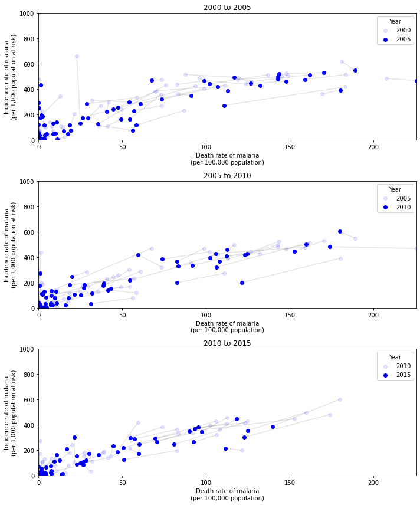
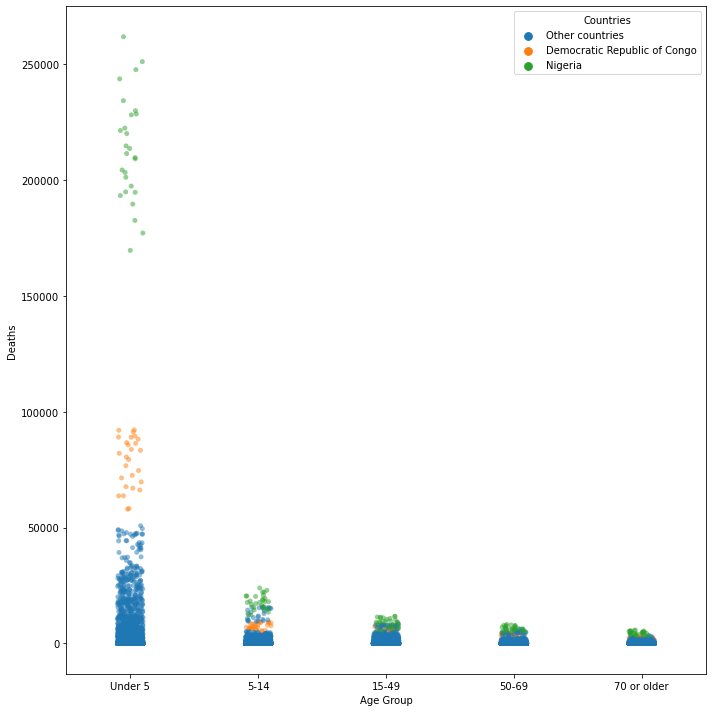
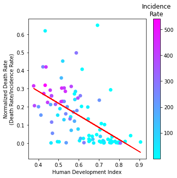

# Analysis of Malaria Dataset

**Author:** Chu Ting Hine Simon  
**E-mail:** simonchuth@gmail.com  

This analysis was performed as a take home exercise. The raw dataset were obtained from the [Malaria Dataset rfordatascience/tidytuesday](https://github.com/rfordatascience/tidytuesday/tree/master/data/2018/2018-11-13).  

## Introduction

Malaria is a life-threatening disease caused by a mosquito-borne parasites. When malaria enters the blood stream of the patient via a mosquito bite, the parasite then travel to the liver, where it proliferate in the host liver cell. Eventually the host liver cells rupture, and the parasites were released to the blood stream to infect other liver cells or red blood cells.  

Malaria could cause the death of the patient due to complications, such as:
* Anemia: As the parasite reproduce in the red blood cells, it cause red blood cells to rupture as it proliferate. This cause the red blood cells counts to decrease, eventuallyleading to anemia (lack of healthy red blood cells to carry oxygen).
* Organ failure: The parasite might also reproduce in the liver or spleen, causing damages to these organ as they multiply, leading to failure of these organ.
* Cerebral malaria: Parasite filled blood could blockage and damages blood vessel leading to the brain, thus decresaing oxygen and nutrient supply to the brain. This could lead to seizures, coma, or even death. 

## Visualisation 1

As the number of cases of malaria (incidence rate) increases, it will put more strain on the healthcare system, resulting in 
a corresponding raise in the death rate of malaria. However, with global effort in place to tackle malaria, such as the [WHO Global Malaria Programme](https://www.who.int/malaria/about_us/en/), the incidence and death rate of malaria would ideally be on a declining trend.  

Objective: To investigate if the incidence rate of malaria correlates with its deaths rate, and how does this correlation change as across different years.  

The 3 subplots shows the how the malaria incidence rate (y-axis) and death rate (x-axis) changed from 2000 to 2015 (each subplot in 5-years interval). The points in `light blue` denotes the datapoints from the earlier reference year (e.g. 2000), and the points in `dark blue` denotes the datapoints from 5 years later (e.g. 2005). The `lines` connecting 2 points (reference year, 5 years later) denote that the pair of points are from the same country. Hence, the subplots shows how the malaria incidence rate and death rate of a country changes within a 5-years timeframe.  

As expected, there is a positive correlation between the incidence rate and death rate of malaria. As the incidence rate of malaria increases, the death rate of malaria also increases. It was also worth noting that for most countries, the incidences rate and death rate of malaria drop across the years, which might indicates that efforts in tackling malaria are effective. 

## Visualisation 2

According to the WHO [fact sheet on malaria](https://www.who.int/news-room/fact-sheets/detail/malaria#:~:text=Children%20under%205%20years%20of%20age%20are%20the%20most%20vulnerable,of%20all%20malaria%20deaths%20worldwide.), children under 5 years of age were known to be the most vulnerable group affected by malaria. The immune system of children under the age of 5 were still developing, which might explain why children are more vulnerable to malaria. As they grow older, previous exposure to malaria trained their adaptive immune system to defend against subsequent exposure to malaria, thus improving their prognosis.  

Objective: To investigate how the mortality of malaria changes in age group.

This graph show the `deaths` (presumably the malaria death rate) in different age groups. Aligned with current knowledge, children under the age of 5 had the highest death rate. The death rate decreases as age increases, presumably due to improved immune response against malaria. It was also worth noting that `Nigeria` was the most badly affected country, and `Democratic Republic of Congo` was the second most badly affected country. Both countries have the highest death rate for children under the age of 5. For the other age groups, the death rates for `Nigeria` and `Democratic Republic of Congo` were also consistently higher than the other countries.  

**Caveat:** `Deaths` was not properly defined in the raw data, it was assumed to be the death rate. The raw data have been group by the different age group, but it was not known if the `deaths` was normalised to the population for the respective age group. It was surprising the `70 or older` have a lower `deaths` than the age group `15-49`. The immune system of an individual above 70 should start to deteriorate, and the `deaths` (if it is death rate and it was normalized to the population of the respective age group) would be higher than age group `15-49`. Hence, it might be possible that the low `deaths` in `70 or older` could be due to a smaller population of people in this age group. 

## Visualisation 3

Developed countries with stronger economy generally will be able to afford a better healthcare system. Therefore malaria patients from these developed countries should be able to receive better care, and have a better prognosis. The Human Development Index (HDI) is a summary measure of average achievement in various important dimensions of human development, thus it could be a good approximate of how developed the country is. The HDI (year 2018) of most countries found in the dataset could be found from the [Human Development Reports of the United Nations Development Programme](http://hdr.undp.org/en/composite/HDI). The data was extracted and preprocessed into csv format, which was upload into this [GitHub repo](https://github.com/simonchuth/sgh_assessment/blob/master/country_hdi.csv).  

Objective: To investigate if patient from more developed countries (higher HDI) have a better prognosis when infected with malaria.

To approximate the prognosis of malaria patient, I have engineered a new feature (Normalized Death Rate) as the `y-axis`, which is the death rate divided by the incidence rate. The intution of this feature is that a high Normalized Death Rate would mean that patient infected with malaria will be more likely to die (worst prognosis), while a lower Normalized Death Rate would mean that patient infected with malaria will more likely to survive (better prognosis).  

The `x-axis` of the graph is the Human Development Index (measure of how developed the country is). The colour of the points corresponds to the malaria incidence rate.  

This figure is conveying several messages. 
* First, the graph shows that the normalized death rate decreases with higher HDI, suggesting that the prognosis of patient will be better in more developed countries. The red trendline shows a negative correlation between the normalised death rate and the HDI of the country. 
* Second, there are countries with low HDI, yet they have a very low normalized death rate. These countries generally have a low malaria incidence rate, thus their countries healthcare system were still able to provide adequate care to have a good prognosis.  
* Third, it was also worth noting that generally countires with lower HDI also have a higher incidence rate of malaria. This suggests that devloping countries might not have sufficient budget to put in place a adequate programme for the eradication of malaria, thus malaria is still prevalent in these countries.